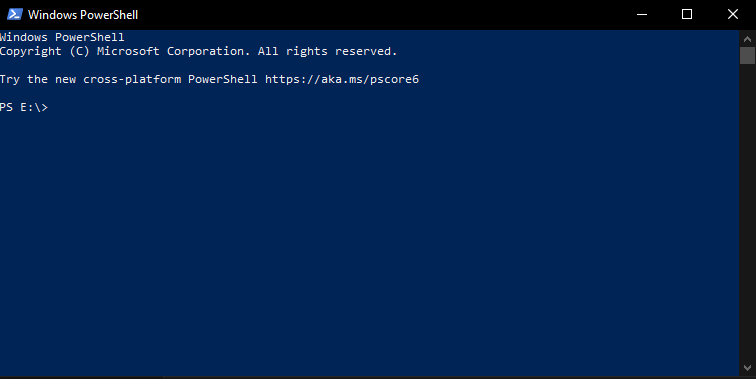

# Learning how to use the terminal
The terminal is used a lot in programming.\
Its mainly used to run or build your code but its also used to go trough your files, create files and folders, delete them and a lot more.

## Opening the terminal
There are multiple consoles but i recommend using powershell.\

### Powershell using the windows terminal
The windows terminal is an in built future of windows 10 and 11.\
(If you do'nt have it installed you can install it from [here](https://apps.microsoft.com/detail/9N0DX20HK701?hl=en-us&gl=US) or from their github page [here](https://github.com/microsoft/terminal))\
The terminal should automatically open a powershell terminal. This should look something like this\


### Powershell without the windows terminal
You can also use powershell without the windows terminal.\
This can be done by just running the powershell program which should look like this\


## The file system
The current path is displayed before the input.\
\
- `PS` > PS means that you are in the powershell.
- `E:\` > This means that you are currently in the `E` drive.
- `Programming\teaching` > This is the current path you are executing commands in. The path is the tree of the folders you are in so in this case i am in the `teaching` folder which is inside the `Programming` folder which itself is inside the `E` drive.
- `>` > This means the input. Everything you type will show after this

You also have a few symbols that do specific things.\
- `.` > A normal dot means the current directory.
- `..` > a double dot means the previous directory. For example if i am inside `E:\Programming\teaching`, `..` will mean `E:\Programming`.
- `\` > a backslash means the root of the drive. For example if i am inside `E:\Programming\teaching`, `\` will mean `E:\`.

## Basic commands
Commands can be executed by typing text and pressing enter.

If things are in square brackets **[ ]** its a required argument.
If things are in normal brackets **( )** its an optional argument

### cd [path]
The `cd` (meaning "change directory") command makes you move between directories.\
Examples:
```ps
PS E:\Programming\teaching> cd . 
# This will stay in the current directory as . means the current directory

PS E:\Programming\teaching> cd .\someDir 
# This will go to E:\Programming\teaching\someDir as you go to the current directory and then into the directory called someDir

PS E:\Programming\teaching> cd .. 
# This will go you E:\Programming as .. means the previous directory

PS E:\Programming\teaching> cd \ 
# This will go to E:\ as \ means the root of the drive

PS E:\Programming\teaching> cd \Programs 
# This will go to E:\Programs as \ means the root of the drive and from there you go into the Programs folder

PS E:\Programming\teaching> cd ..\someDir 
# This will go to E:\Programming\someDir as you go 1 directory back using .. and then into the directory called someDir
```

### ls (path)
The `ls` command (same as the `dir`) command shows all files and directories in your current directory.\
This is useful for the [cd](#cd) command to know where you can go.

The default argument is the current directory which would be the same as `ls .`

### del [file]
The `del` command is used to delete files.

### mkdir [dirName]
The `mkdir` command is used to create directories.

### rmdir [dirName]
The `rmdir` command is used to delete directories.
